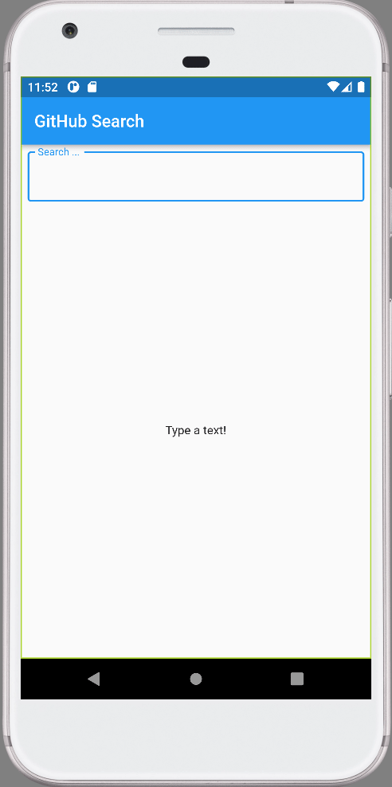

# GitHub Repository Search applying Clean Architecture

This app search users by name in the GitHub repository.
It was written in Flutter and Dart using a Clean Architecture with the layers completely isolate.
The app has complete cover of tests that was used with the technique TDD (Test Driven Development - https://en.wikipedia.org/wiki/Test-driven_development).

## App Demo

The image below demonstrates how the application works.

## Libraries

Libraries used in the app:

- **dartz:** functional programming
- **dio:** http client
- **flutter_modular:** project structure
- **flutter_bloc:** blocs and cubits
- **mocktail:** tests and mocks
- **rxdart:** extension of Dart Streams and StreamControllers
